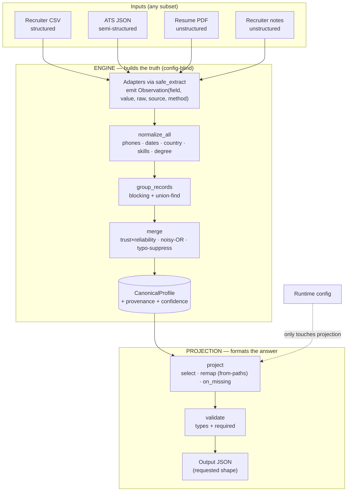
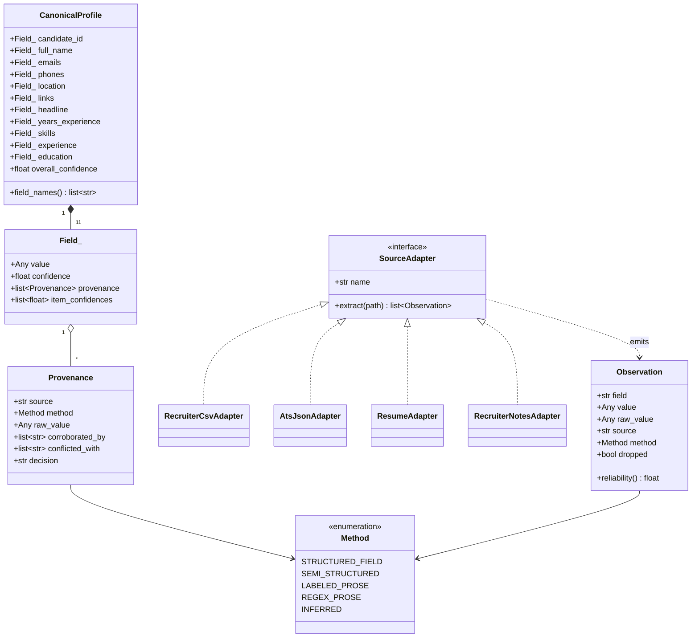
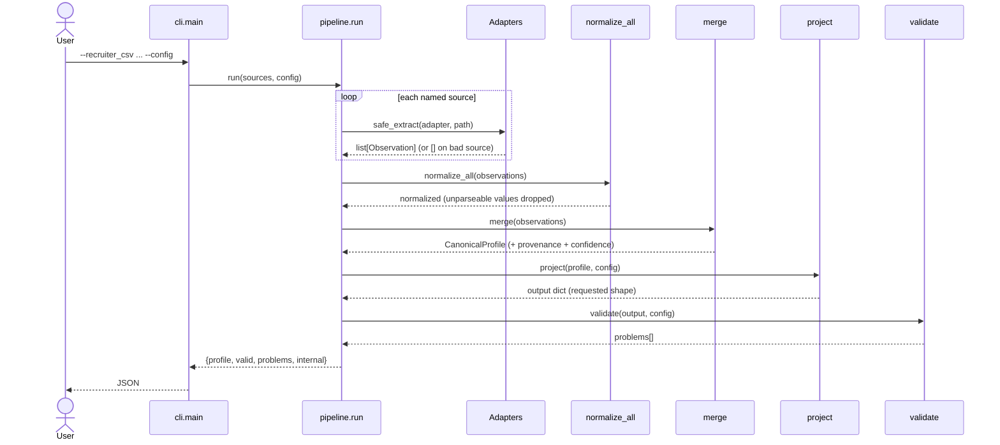
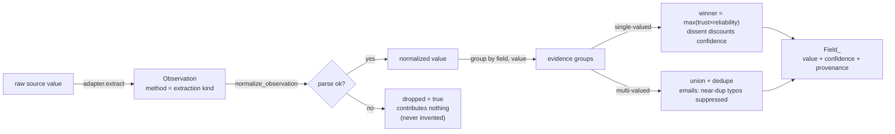

# Architecture

This is the deep-dive companion to the one-page Stage 1 design PDF. Every
diagram below is generated from the actual code in `src/canonical/` — the
sources live in [`docs/diagrams/`](docs/diagrams) as editable `.mmd` files and
render natively on GitHub.

**North star:** the system optimises for one property — *never be confidently
wrong*. "Wrong-but-confident is worse than honestly-empty." Everything here is
derived from that plus the brief's four constraints: deterministic, explainable,
robust, scalable.

---

## The core idea: build truth once, then project it

The single most important boundary in the system: the **engine** builds one
rich, fixed internal record (`CanonicalProfile`) with full provenance and
confidence, and the **projection layer** is the *only* code that knows the
requested output shape. The engine never imports or sees the config. Changing
the output is pure config; it can never touch resolution logic.

---

## Class model

The data model is deliberately small. Adapters emit `Observation`s; the merge
stage resolves them into one `Field_` per canonical field (value + confidence +
provenance); eleven `Field_`s make a `CanonicalProfile`.

---

## Request lifecycle

A single `run()` call (`pipeline.run`) flows through the stages in order.
`extract_sources` runs each adapter under `safe_extract` and then `normalize_all`.

---

## Observation lifecycle

How one observation becomes part of a resolved field. The `dropped` branch is
the load-bearing one: an unparseable value contributes nothing rather than
becoming a confident guess.

---

## Stage responsibilities (where each lives)

| Stage | File | Responsibility |
|-------|------|----------------|
| extract | `sources/*.py` + `sources/base.py` | one adapter per source → `Observation`s; `safe_extract` guarantees a bad source yields `[]`, never a crash |
| normalize | `normalize_stage.py`, `normalize/` | phones→E.164, dates→`YYYY-MM`, country→ISO-3166, skills→canonical, degree→canonical; failure ⇒ `dropped` |
| match | `match.py` | `group_records`: blocking + union-find clusters records for one person; scales past one candidate |
| confidence | `confidence.py` | `strength = trust × reliability`; `noisy_or`; conflict discount |
| merge | `merge.py` | per-field winner / union; `_resolve_links` (object shape); `_suppress_typos`; `candidate_id` fallback |
| project | `project.py` | config-driven select / remap / `on_missing`; the only config-aware code |
| validate | `validate.py` | projected output vs requested schema (types + required) |
| orchestrate | `pipeline.py`, `cli.py` | `run` / `run_batch`; CLI surface with `--explain` |

---

## Key algorithms

**Trust = source × method.** Each observation's weight is
`SOURCE_TRUST[source] × METHOD_RELIABILITY[method]`. A CSV column (`1.0 × 1.0`)
outranks a regex-from-prose hit (`0.65 × 0.50`) even for the same field. Source
trust and method reliability are data tables (policy), kept out of the merge
logic (mechanism).

**Confidence = noisy-OR.** `c = 1 − Π(1 − sᵢ)` over agreeing evidence. One
strong source already scores high; corroboration raises it (an average
wouldn't); conflicting evidence discounts the winner. Below a floor a
single-valued field is emitted `null`.

**Matching = blocking + union-find.** The only super-linear cost at scale.
Records sharing a strong key (normalized email/phone) are unioned via a
path-compressed disjoint-set, keeping the dominant cost near-linear instead of
O(n²). Everything else is left simple on purpose.

**Email typo suppression.** A low-confidence email within edit-similarity ≥ 88
of a higher-confidence one is treated as a corruption of it and dropped — the
"wrong-but-confident is worse than empty" principle in running code.

---

## Extending the system: add a source

1. Write an adapter class with `name` and `extract(path) -> list[Observation]`,
   tagging each value with the right `Method`.
2. Register it in `sources/__init__.py` (`ADAPTERS`) and give it a `SOURCE_TRUST`.
3. Done — normalize, match, merge, project, validate all work unchanged, because
   they only ever see `Observation`s.

---

## Design decisions & rejected alternatives

- **LLM/ML resolution — rejected.** Non-deterministic and untraceable, and it
  would confidently mis-map `Java → JavaScript` (the exact failure to avoid).
  Rule-based resolution with a similarity floor cannot make that error.
- **Last-write-wins merge — rejected.** Can't explain or score a decision.
- **Deliberately out of scope (time):** a UI (CLI suffices per brief), a
  persistent datastore, and ML entity-resolution — blocking + strong keys is the
  right complexity here.

## Limitations (honest)

- Free-text resume parsing is best-effort: dense "Tool (sub, sub)" lists and
  mid-word line breaks in PDFs can leave minor skill fragments.
- Location is not extracted from resume header lines (comes from structured
  sources); absent ⇒ `null`, never guessed.
- Single default phone region (`US`) when no country code is present.
