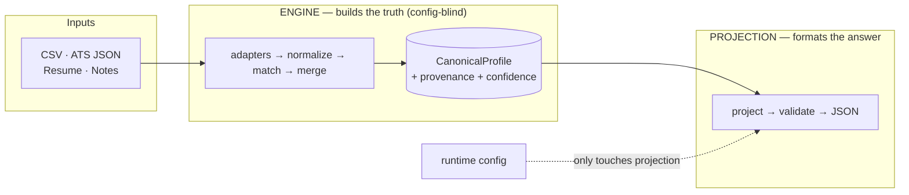
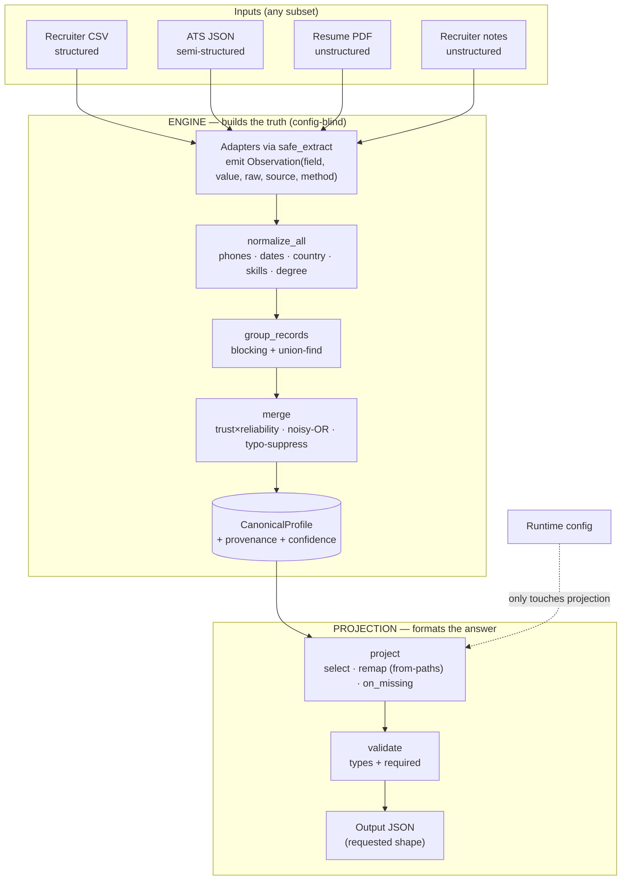
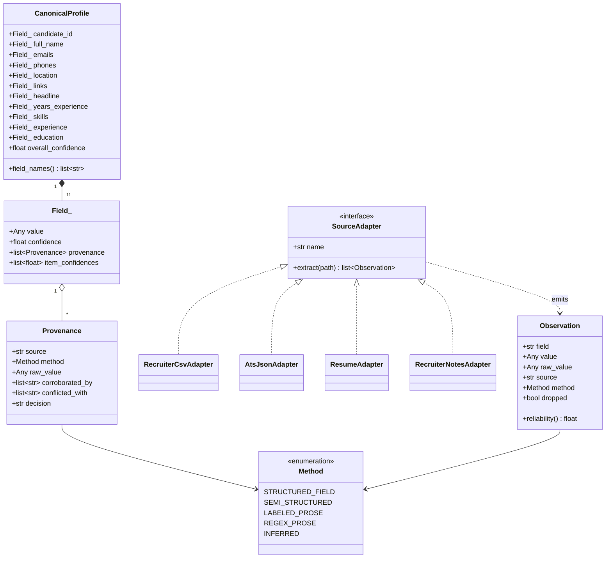
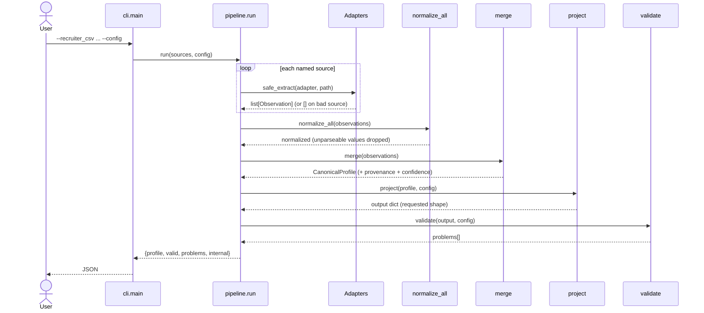
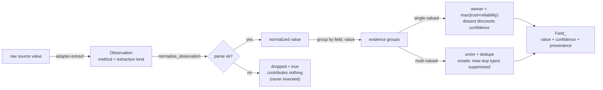

# Multi-Source Candidate Data Transformer

Takes messy candidate data from several sources — some structured, some free
text — and reconciles it into **one clean, canonical profile** where every field
is **traceable to its source** and carries a **confidence score**. The guiding
principle throughout, straight from the brief, is that **wrong-but-confident is
worse than honestly-empty**: when in doubt, the engine emits `null`, never a
guess.

---

## Architecture at a glance

The engine builds one rich internal record; a separate projection layer formats
the requested output. The engine never sees the output config — so output
changes can never touch resolution logic.



📐 **Full design:** deeper diagrams (class model, request sequence, observation
lifecycle) and rationale live in **[ARCHITECTURE.md](ARCHITECTURE.md)**; editable
sources are in [`docs/diagrams/`](docs/diagrams). The one-page Stage 1 design is
[`outputs/HarshSahu_harshsahuhh@gmail.com_Eightfold.pdf`](outputs/).

---

## Quick start

```bash
python -m venv .venv && source .venv/bin/activate   # Windows: .venv\Scripts\activate
pip install -r requirements.txt
pip install -e .                 # optional: gives a `canonical` command, no PYTHONPATH needed

# Run end to end on the sample inputs (default schema, with confidence + provenance)
PYTHONPATH=src python -m canonical.cli \
  --recruiter_csv data/sample/recruiter_export.csv \
  --ats_json      data/sample/ats_profile.json \
  --resume        data/sample/resume.pdf \
  --recruiter_notes data/sample/recruiter_notes.txt \
  --config configs/default.json

# A custom output shape (subset, renames, from-paths, missing-value policy)
PYTHONPATH=src python -m canonical.cli ... --config configs/custom_minimal.json

# See exactly where every value came from and why
PYTHONPATH=src python -m canonical.cli ... --explain

# Tests
python -m pytest -q
```

Pre-generated outputs are committed under [`outputs/`](outputs/) so you can see
the result without running anything.

---

## What the engine does (pipeline)

```
detect → extract → normalize → match → merge → project → validate
```

| Stage | Responsibility |
|-------|----------------|
| **extract** | One adapter per source turns raw input into typed `Observation`s `(field, value, raw_value, source, method)`. Nothing downstream ever sees a raw source again. |
| **normalize** | Per-field canonicalization: phones → E.164, dates → `YYYY-MM`, country → ISO-3166 alpha-2, skills → canonical names. Failure → the value is **dropped**, never invented. |
| **match** | Entity resolution. Clusters records that refer to the same person using blocking + union-find, so the same engine handles one candidate or thousands. |
| **merge** | Per-field conflict resolution. Picks a winner by source-trust × method-reliability, unions multi-valued fields, suppresses likely typos, records provenance. |
| **project** | The configurable output layer — the *only* part that knows the requested output shape. |
| **validate** | Checks the projected output against the requested schema (types + required). |

The single most important boundary: the engine always builds one rich, fixed
**internal canonical record**; the **projection layer** is a separate
transform on top of it. The engine never knows the output config exists.

---

## Key design decisions

**Observation-based core.** Every source emits a flat stream of observations.
Adding a new source = writing one adapter; zero changes elsewhere. This is the
extensibility story and the reason the pipeline reads as a clean sequence of
pure transforms.

**Trust = source × method.** A phone in a CSV column (`structured_field`,
reliability 1.0) is trusted far more than one regex-matched out of resume prose
(`regex_prose`, 0.5), even though the resume is otherwise a fine source. Each
source also has a trust weight (curated CSV 1.0 → hand-typed notes 0.55). The
two multiply.

**Confidence via noisy-OR.** `confidence = 1 − Π(1 − strengthᵢ)` over agreeing
evidence. One strong source already scores high; multiple agreeing sources push
higher but never past 1.0. Conflicting evidence *discounts* the winner — disagreement
should make us less sure. Below a floor, a single-valued field is emitted as
`null` rather than a low-trust guess.

**Typo suppression for emails.** A low-confidence email that is a near-duplicate
(edit-similarity ≥ 88) of a higher-confidence one is treated as a corruption of
it and suppressed — e.g. `maya.chen@exmaple.con` never ships alongside the
verified `maya.chen@example.com`. This is the brief's core principle made
concrete: a silent typo would break outreach worse than an empty field would.

**Optimize the one thing that matters.** At "thousands of candidates" scale the
only super-linear cost is matching. We use **blocking + union-find** to keep it
near-linear, and **rapidfuzz** (C-backed) with an O(1) alias-map fast path for
fuzzy work. Everywhere else (normalizing one value, scoring one field) is cheap
and deliberately left simple and readable — optimizing it would add risk for no
gain.

---

## Configurable output

The config reshapes the output without touching the engine:

```jsonc
{
  "fields": [
    { "path": "full_name",     "type": "string",  "required": true },
    { "path": "primary_email", "from": "emails[0]", "type": "string", "required": true },
    { "path": "phone",         "from": "phones[0]", "type": "string", "normalize": "E164" },
    { "path": "skills",        "from": "skills[].name", "type": "string[]" },
    { "path": "github",        "from": "links.github",  "on_missing": "omit" }
  ],
  "include_confidence": true,
  "on_missing": "null"          // null | omit | error
}
```

`from` supports a small path language: `emails[0]` (index), `location.city`
(nested), `skills[].name` (map a key over a list). Missing values follow the
per-field `on_missing` policy, falling back to the top-level default.

---

## Edge cases handled (and where to see them)

| Edge case | Sample data | Result |
|-----------|-------------|--------|
| Same phone in 3 formats | csv / ats / notes | all collapse to `+14155550182` |
| Typo'd email | `recruiter_notes.txt` | suppressed; verified email kept |
| Conflicting job title | csv vs ats | CSV wins on trust; conflict recorded |
| Non-canonical skills (`JS`, `k8s`) | resume / ats | mapped to `JavaScript`, `Kubernetes` |
| `Java` vs `JavaScript` | (test) | **not** conflated — mis-mapping refused |
| Corrupt source file | (test / `--verbose`) | skipped with a warning, run continues |
| Field no source provides | any run | stays `null` / `[]`, never invented |

Run with `--explain` to see the provenance and per-field confidence for each
decision.

---

## Layout

```
src/canonical/
  models.py          # Observation, CanonicalProfile, provenance
  sources/           # one adapter per source (+ trust weights, safe wrapper)
  normalize/         # phone, dates, country, skills
  normalize_stage.py # applies normalizers; drops on failure
  match.py           # blocking + union-find entity resolution
  confidence.py      # noisy-OR scoring
  merge.py           # conflict resolution + typo suppression
  project.py         # config-driven projection (the "twist")
  validate.py        # output schema validation
  pipeline.py        # orchestration (run / run_batch)
  cli.py             # command-line surface
data/sample/         # fabricated multi-source inputs with planted conflicts
configs/             # default + custom output configs
outputs/             # committed sample outputs
tests/               # unit + gold-profile + robustness + determinism
```

## Assumptions & scope

- **Sample data is fabricated** (no packet was provided), with conflicts planted
  to exercise each part of the engine; the data is realistic, not toy.
- Default phone region is `US` when a number carries no country code.
- The PDF resume adapter handles a `.txt` fallback so the pipeline is demoable
  without a PDF toolchain.
- Deliberately descoped: a UI (CLI is sufficient per the brief), ML-based entity
  resolution (blocking + strong keys is the right complexity here), and a
  persistent datastore.


# Architecture

This is the deep-dive companion to the one-page Stage 1 design PDF. Every
diagram below is generated from the actual code in `src/canonical/` — the
sources live in [`docs/diagrams/`](docs/diagrams) as editable `.mmd` files and
render natively on GitHub.

**North star:** the system optimises for one property — *never be confidently
wrong*. "Wrong-but-confident is worse than honestly-empty." Everything here is
derived from that plus the brief's four constraints: deterministic, explainable,
robust, scalable.

---

## The core idea: build truth once, then project it

The single most important boundary in the system: the **engine** builds one
rich, fixed internal record (`CanonicalProfile`) with full provenance and
confidence, and the **projection layer** is the *only* code that knows the
requested output shape. The engine never imports or sees the config. Changing
the output is pure config; it can never touch resolution logic.



---

## Class model

The data model is deliberately small. Adapters emit `Observation`s; the merge
stage resolves them into one `Field_` per canonical field (value + confidence +
provenance); eleven `Field_`s make a `CanonicalProfile`.



---

## Request lifecycle

A single `run()` call (`pipeline.run`) flows through the stages in order.
`extract_sources` runs each adapter under `safe_extract` and then `normalize_all`.



---

## Observation lifecycle

How one observation becomes part of a resolved field. The `dropped` branch is
the load-bearing one: an unparseable value contributes nothing rather than
becoming a confident guess.



---

## Stage responsibilities (where each lives)

| Stage | File | Responsibility |
|-------|------|----------------|
| extract | `sources/*.py` + `sources/base.py` | one adapter per source → `Observation`s; `safe_extract` guarantees a bad source yields `[]`, never a crash |
| normalize | `normalize_stage.py`, `normalize/` | phones→E.164, dates→`YYYY-MM`, country→ISO-3166, skills→canonical, degree→canonical; failure ⇒ `dropped` |
| match | `match.py` | `group_records`: blocking + union-find clusters records for one person; scales past one candidate |
| confidence | `confidence.py` | `strength = trust × reliability`; `noisy_or`; conflict discount |
| merge | `merge.py` | per-field winner / union; `_resolve_links` (object shape); `_suppress_typos`; `candidate_id` fallback |
| project | `project.py` | config-driven select / remap / `on_missing`; the only config-aware code |
| validate | `validate.py` | projected output vs requested schema (types + required) |
| orchestrate | `pipeline.py`, `cli.py` | `run` / `run_batch`; CLI surface with `--explain` |

---

## Key algorithms

**Trust = source × method.** Each observation's weight is
`SOURCE_TRUST[source] × METHOD_RELIABILITY[method]`. A CSV column (`1.0 × 1.0`)
outranks a regex-from-prose hit (`0.65 × 0.50`) even for the same field. Source
trust and method reliability are data tables (policy), kept out of the merge
logic (mechanism).

**Confidence = noisy-OR.** `c = 1 − Π(1 − sᵢ)` over agreeing evidence. One
strong source already scores high; corroboration raises it (an average
wouldn't); conflicting evidence discounts the winner. Below a floor a
single-valued field is emitted `null`.

**Matching = blocking + union-find.** The only super-linear cost at scale.
Records sharing a strong key (normalized email/phone) are unioned via a
path-compressed disjoint-set, keeping the dominant cost near-linear instead of
O(n²). Everything else is left simple on purpose.

**Email typo suppression.** A low-confidence email within edit-similarity ≥ 88
of a higher-confidence one is treated as a corruption of it and dropped — the
"wrong-but-confident is worse than empty" principle in running code.

---

## Extending the system: add a source

1. Write an adapter class with `name` and `extract(path) -> list[Observation]`,
   tagging each value with the right `Method`.
2. Register it in `sources/__init__.py` (`ADAPTERS`) and give it a `SOURCE_TRUST`.
3. Done — normalize, match, merge, project, validate all work unchanged, because
   they only ever see `Observation`s.

---

## Design decisions & rejected alternatives

- **LLM/ML resolution — rejected.** Non-deterministic and untraceable, and it
  would confidently mis-map `Java → JavaScript` (the exact failure to avoid).
  Rule-based resolution with a similarity floor cannot make that error.
- **Last-write-wins merge — rejected.** Can't explain or score a decision.
- **Deliberately out of scope (time):** a UI (CLI suffices per brief), a
  persistent datastore, and ML entity-resolution — blocking + strong keys is the
  right complexity here.

## Limitations (honest)

- Free-text resume parsing is best-effort: dense "Tool (sub, sub)" lists and
  mid-word line breaks in PDFs can leave minor skill fragments.
- Location is not extracted from resume header lines (comes from structured
  sources); absent ⇒ `null`, never guessed.
- Single default phone region (`US`) when no country code is present.
